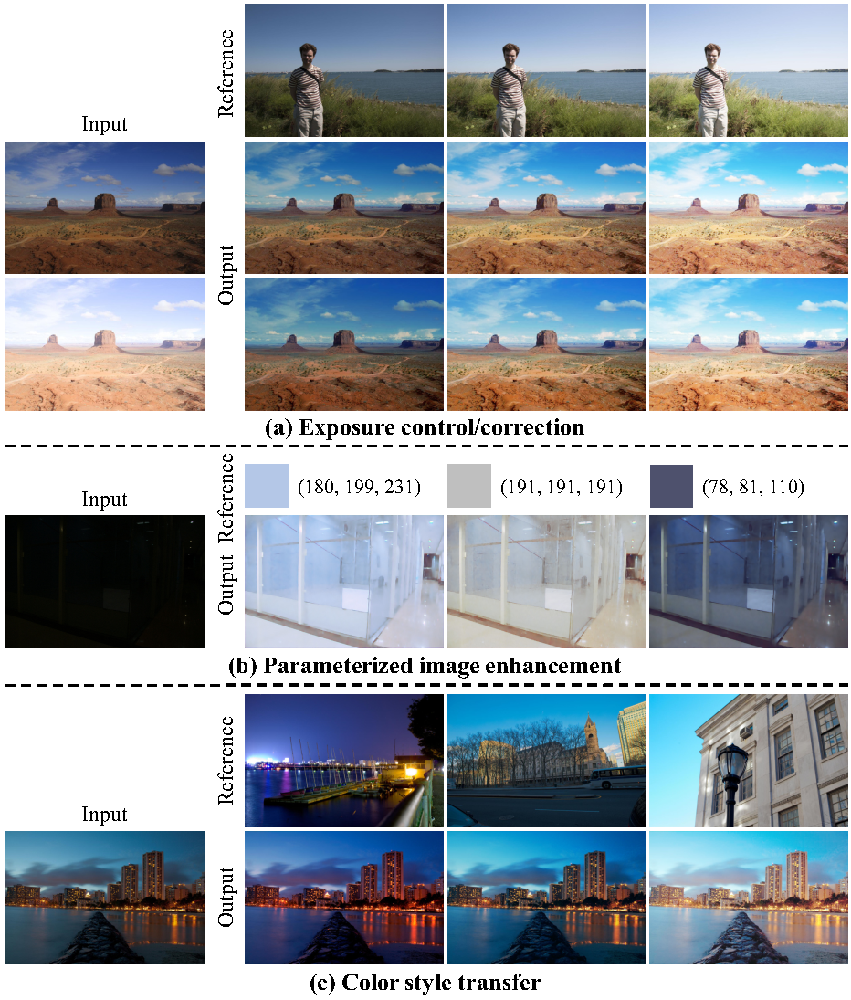

# Normalize-and-Realign: Controllable Image Enhancement across Multiple Exposure Levels

This repository contains the official implementation of the paper **"Normalize-and-Realign: Controllable Image Enhancement across Multiple Exposure Levels"** submitted to the J-STSTP journal. 
---

## Prerequisites

- Python 3.8 or higher
- PyTorch 1.10+

## visual effects
